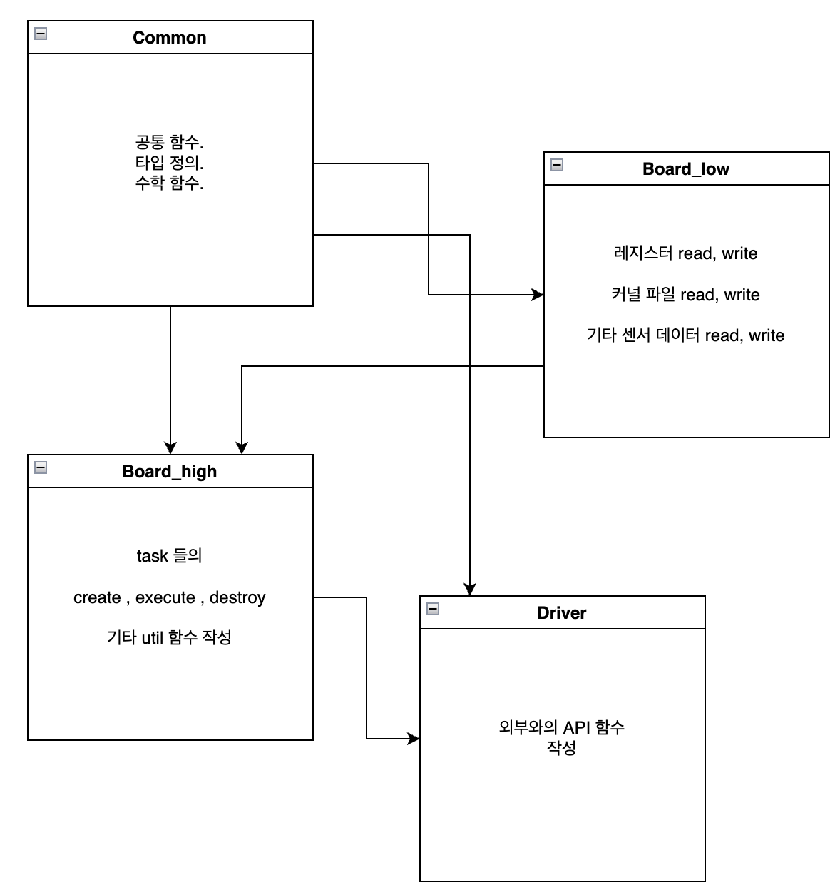

# 개요
rust-lang 와 연결시키거나 library 생성을 위한 c-lang driver code

# cmake
cmake 의 version 은 최소 3.11 이상이 필요합니다. 참고하세요.

# 빌드
```shell

/bin/sh -c "
cmake -DKERNEL_TYPE=TK -DOPER_TYPE=V1 -Bbuild -DCMAKE_BUILD_TYPE=Release \
    && cmake --build build --target cute_driver_shared \
"
```

# 컴파일 옵션
+ `KERNEL_TYPE` : 커널에 해당하는 타입을 입력합니다.
+ `OPER_TYPE` : 응용 프로그램에 해당하는 타입을 입력합니다.

# 데이터 반환
모든 데이터는 `cute_driver_result` 로 반환됩니다.

데이터는 heap 영역 및 stack 영역으로 나뉘어져 있습니다.

개발자는 create , execute , destroy 를 이용하여 데이터를 가져오고 해결 해야 합니다.
+ create 를 통해 만들어진 context `cute_driver_result` 를 이용하여 execute 를 수행하여야 합니다.
  + 전역 변수 사용을 거이 금하고 있기에 execute 마다 결과를 동적으로 바꾸고 싶은 경우에는 다음과 같이 해야합니다.
    + create 시에 동적 프로그래밍을 위한 부분을 추가한다.
    + execute 를 수행할때 마다 이용하면 된다.
+ execute 시에 결과는 `output.h` 의 타입을 통해 memcpy 또는 void pointer 타입으로 래핑됩니다.
  + 유저는 이를 참고하여 해당 데이터를 변환하시기 바랍니다.
+ destroy 를 수행하지 않는다면 메모리 누수가 발생할 수 있다.

# 간략한 구조
